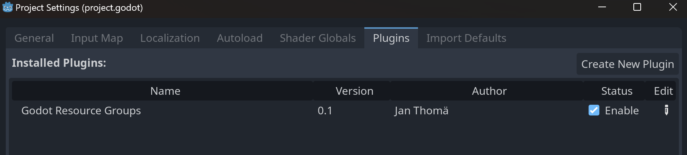
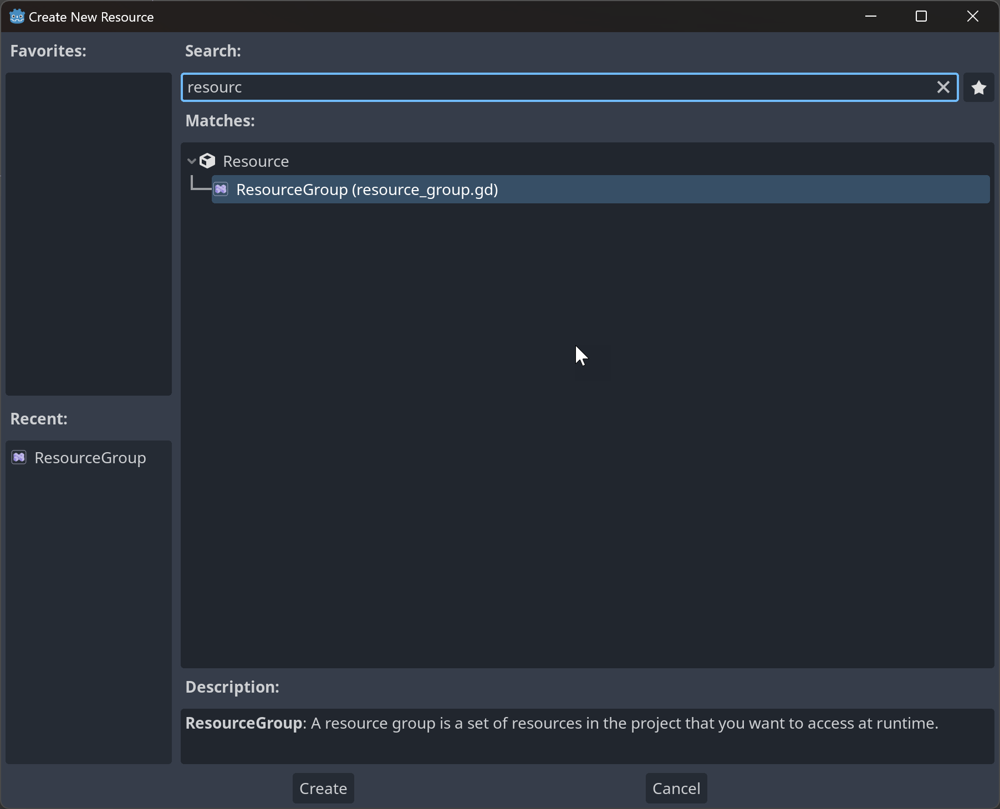
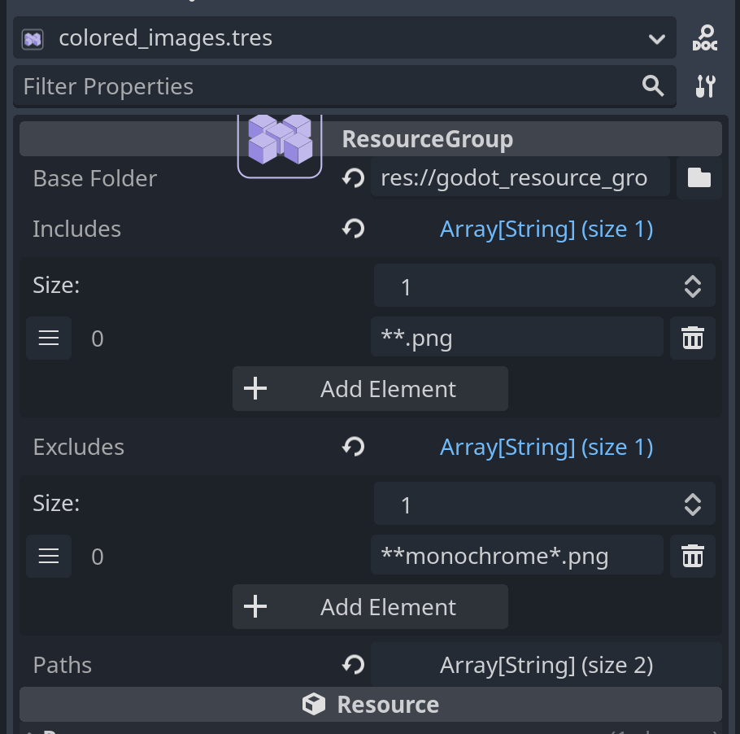

# Godot Resource Groups

_This library is still quite new and has not seen much use yet. While it works reasonably well, there may still be bugs. Please report any issues you find._

<!--suppress HtmlDeprecatedAttribute -->
<p align="center"></p>

## Introduction

Godot Resource Groups is a library for managing resource groups in Godot. It allows you to define resource groups - a set of resources that belong together. You can then load these resources from your game code with a single line without having to hardcode the paths to the resources and doing any directory scanning. This is useful in a variety of situations:

- you want to load all resources in a folder (e.g. all levels in your game to make a level selection screen)
- you want to pre-load resources to avoid stuttering when loading them for the first time 
- you want to load resources from a mod without hard-coding any paths

Resource groups are defined with path expressions and wildcards so they are resilient to changes in your project structure and automatically update when you add, remove or rename resources.

## Installation

The easiest way to install the plugin is to use the Godot Asset Library directly in Godot. Search for "Godot Resource Groups" and install the plugin. You can exclude the `godot_resource_groups_examples` folder if you don't need the examples. 

You can also download a ZIP file of this repository from the [release page](https://github.com/derkork/godot-resource-groups/releases) and extract it, then copy the `addons/godot_resource_groups` folder into your project's `addons` folder.

After you installed it, make sure you enable the plugin in the project settings:




### Installation with C#

If you want to use this library with C#, make sure you are using the .NET version of Godot 4. This can be downloaded from the [Godot download page](https://godotengine.org/download). The standard version of Godot 4 does not support C#. If you got Godot from Steam, you have the standard version and need to download the .NET version separately from the Godot website. There are additional installation steps for the Godot .NET version, so make sure you follow the instructions on the [Godot documentation](https://docs.godotengine.org/en/stable/tutorials/scripting/c_sharp/c_sharp_basics.html).

After you installed the plugin as described above, you may need to initialize your C# project if you haven't already done so. You can do this by going to the menu _Project_ -> _Tools_ -> _C#_ -> _Create C# solution_.


> ⚠️ **Note**: the C# API is currently experimental and may change in the future. Please give it a try and let me know if you encounter any issues.


## Usage
### Creating a resource group

This addon adds a new resource type called `ResourceGroup`. You can create a new resource group by right-clicking in the FileSystem dock and selecting "New" -> "Resource" and then "ResourceGroup".



### Adding resources to a resource group

To add resources to a resource group, select the resource group in the file system. Now you can configure it in the inspector. 



The resource group has three properties:

- _Base Folder_ - the folder that contains the resources you want to add to the resource group. This must be a folder inside of the project folder, it cannot be outside of it.
- _Includes_ - a list of path expressions that define which resources should be included in the resource group. If this is empty, then _all_ resources in the base folder will be included.
- _Excludes_ - a list of path expressions that define which resources should be excluded from the resource group. Can be empty, in which case no resources will be excluded.

Both _Includes_ and _Excludes_ are lists of path expressions. A path expression is a string that can contain wildcards. The following wildcards are supported:

- `*` - matches any number of characters except `/`
- `**` - matches any number of characters including `/`
- `?` - matches exactly one character except `/`

For example, the path expression `**.png` will match all PNG files in the base folder and all subfolders. The path expression `foo/*.png` will match all PNG files in the `foo` folder. The path expression `foo/**.png` will match all PNG files in the `foo` folder and all subfolders of the `foo` folder. The expression `image?.png` will match `image1.png` and `image2.png` but not `image.png` or `image12.png`.

Whenever the project is saved, resource groups will be automatically updated. This means that if you add or remove resources in the base folder, the resource group will automatically be updated to include or exclude these resources based on the path expressions that you have given.

### Loading resources from a resource group

To load resources from a resource group, you first must load the resource group.

```gdscript
var resource_group:ResourceGroup = load("res://path/to/resource_group.tres")
```

Since ResourceGroups are defined in GDScript you can't use them directly in C#. Therefore this library provides a C# wrapper around the GDScript ResourceGroup class. You can load a resource group in C# like this:

```csharp
var resourceGroup = ResourceGroup.Of("res://path/to/resource_group.tres");
``` 

Now you can load all resources in the resource group with a single line:

```gdscript
var resources = resource_group.load_all()
```

in C#:

```csharp
var resources = resourceGroup.LoadAll();
```

This will return an array of all resources in the resource group. The resources will be loaded if they are not already loaded. If you only need a subset of the resources, you can use the `load_matching` method instead:

```gdscript
# load all PNG files, except those that contain "monochrome" in their name
var resources = resource_group.load_matching(["*.png"], ["*monochrome*.png"])
```

in C#:

```csharp
// load all PNG files, except those that contain "monochrome" in their name
var resources = resourceGroup.LoadMatching(new []{"*.png"}, new []{"*monochrome*.png"});
```

## FAQ

### How do I select all but a few resources?

You can use the `Excludes` property to exclude resources from the resource group. For example, if you want to include all levels in your game except the tutorial levels, you could set this up like this:

- _Base Folder_: `res://levels`
- _Includes_: `**.tscn`
- _Excludes_: `**tutorial.tscn`

### Will this work when the game is exported?

Yes, this is one of the problems that this library solves. As resources are packaged into PCK files when the game is exported, you cannot easily get a list of all resources in a folder anymore after exporting, because the file system API does not work inside PCK files. This library solves this problem by storing the list of resources in the resource group itself, so all you need to do is load up your well-known resource group and you can get a list of all resources in it.